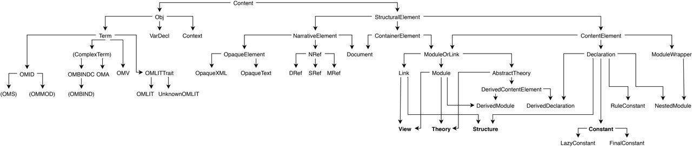

This section gives an overview of MMT's **abstract syntax** and the corresponding classes in the [MMT API](../). MMT's surface syntax is described in detail [here](../../language/).

### Abstract Grammar

The (simplified) abstract syntax of MMT is:

 Level | Symbol | Grammar | Description
---- |----: | :---- | ----
*Document Level* | | |
. | `Doc` | `:= (Thy | Mor)*` | [Documents](narrative)
*Module Level* | | |
. | `Thy` | `:= c [:o] = {Dec*}` | [Theories](../../language/modules.html#theories)
. | `Mor` | `:= c : o -> o = {Ass*}` | [Views](../../language/modules.html#views)
*Symbol Level* | | |
. | `Dec` | `:= c [:o] [=o] [#N]` | [Declarations]((../../language/declarations.html)
. | `Ass` | `:= c = o` | Symbol [Assignments]((../../language/declarations.html#constants)
*Object Level* | | |
. | `o`   | `:= c | x | c( (x[: o])* ; o* ) | c(STRING)` | [Objects/Terms](objects)
. | `N`   |   | [Notations](../../language/declarations.html#constants)
. | `c`   |   | [URI](uris)
. | `x`   |   | [Variable](objects)

### Data Structures

**[`api.Content`](apidoc://info.kwarc.mmt.api.Content)** is the top level datastructure for all of the classes representing the MMT language. For our purposes, it branches into 
* [`api.NarrativeElement`](apidoc://info.kwarc.mmt.api.NarrativeElement) (described [here](narrative)), e.g. documents,
* [`api.StructuralElement`](apidoc://info.kwarc.mmt.api.ContentElement) (described [here](content)), e.g. modules, declarations and 
* [`objects.Obj`](apidoc://info.kwarc.mmt.api.objects.Obj) (described [here](objects)), e.g. terms and contexts.

The following inheritance graph gives an overview of the most relevant data structures in the [MMT API](../):

