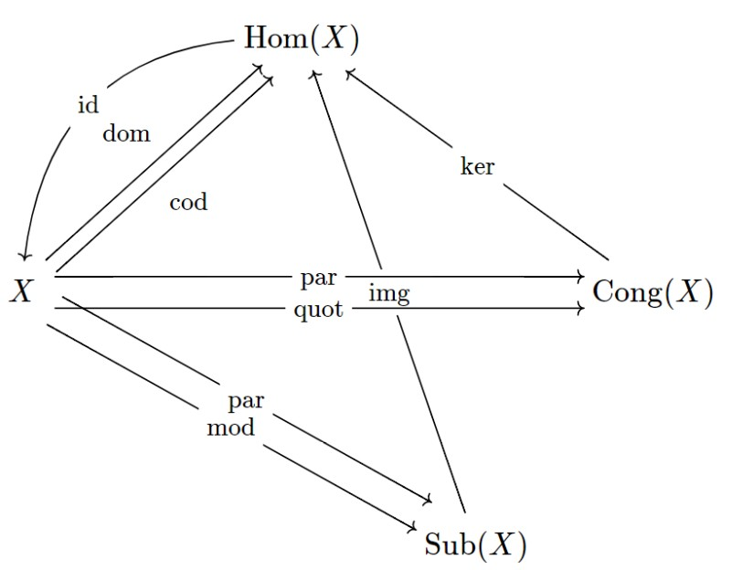

In larger formalizations, parts of theory graphs are often redundant and have been created in a *systematic* way from other parts of the theory graph.
As of December 2020, MMT has preliminary support for diagram operators, which are Scala functions accessible from MMT surface syntax allowing to create whole diagrams from input diagrams.

## Caste Study: Universal Algebra

Consider formalizing the algebraic hierarchy with theories for magmas, monoids, groups, and more.
Creating the theories for homomorphisms of magmas, monoids, and groups, respectively would not only be cumbersome to do manually, but
also redundant, as according to [universal algebra](https://en.wikipedia.org/wiki/Universal_algebra), there is a systematic way
to derive the theories of homomorphisms given the underlying algebraic theories.
Leveraging a diagram operator to generate the theories of homomorphisms also has the advantage that whenever anything changes
in the algebraic theories, all homomorphism theories can be re-generated by simply rebuilding the MMT archive.

Similar automatic derivations are possible for the theories of substructures and congruences of magmas, semigroups, and so on.
The following diagram pictures all theories *and* views that can be generated from a single SFOL theory `X` by means of the diagram operators implemented so far (2020-12-16):

