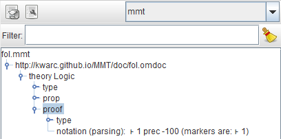
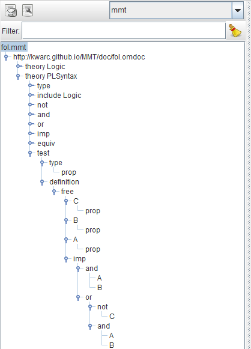

[< 1 - Creating Archives](1archives.html)

We can now open the `fol.mmt` file in `source` with [jEdit](../../applications/jedit.html). If you haven't done so already, I recommend you read the sections on [delimiters](../../language/delimiters.html), [theories](../../language/modules.html#theories) and [constants](../../language/declarations.html#constants) now, so you know how to produce our following basic theory:

(if abbreviations are activated in jEdit, the `→` symbol can be produced with the abbreviation `jra` and the `⊦` symbol with `jvdash`)

This code first introduces a new theory named `Logic` - delimited by  - with meta theory `ur:?LF`. The abbrivation `ur` expands to the [URI](../../language/uris) `http://cds.omdoc.org/urtheories/` - the namespace of the urtheories archive, which contains the theory `LF`. The fully qualified URI is thus `http://cds.omdoc.org/urtheories?LF` (which we could have written instead). We will go into the details of LF [later](3LF.html).

The full URI of our new theory is made up of its name (`Logic`) and the namespace declared in the `MANIFEST.MF` file, i.e. `http://kwarc.github.io/MMT?Logic`.

This theory contains two constants:  

* `prop` with type `type`. `type` is provided by LF and is a *universe*, which means every symbol with type `type` is *inhabitable* (i.e. may occur to the right side of a typing judgment). `prop` will be the type of our propositions. We give it an optional notation `o` for brevity.
* `proof` with type `o → type` and notation `⊦ 1`. `→` is the simple function type constructor and again provided by LF. `o` is just a notation for `prop`, so `proof` is a function that maps propositions to types (more on that later). We give the notation a very low precedence.

We can now parse the document and have MMT type check it. If parse-on-key is not activated (see [here](../../setup/jedit.html)), you can press the parse button (arrow symbol to the top left of the screenshot below) in SideKick, after which it will show the document tree:

Unlike SideKick, the ErrorList window should show nothing - meaning the document type checks correctly. Let's see what happens, if we introduce a simple typo in the type of `proof`, by changing it to `o → tupe`. This is what the ErrorList should show now:

We will look at the details of the error message, after we've looked at LF and its rules. For now, we will remove the typo and continue with a theory specifying the *syntax* of propositional logic. On the basis of the theory we already have, what's missing are the usual logical connectives `∧` (`jwedge`), `∨` (`jvee`), `⇒` (`jrA`), `¬` (`jneg`) and `⇔` (`jLeftrightarrow`), and constants `⊤` (`jtop`) and `⊥` (`jbot`).

For the sake of modularity, we will put those in a new theory, like so:

So we specify the connectives as functions between propositions - e.g. `and` takes two propositions (of type `o`=`prop`) and returns a new proposition. We assign precedences according to standard mathematical convention - e.g. `∧` binds stronger than e.g. `⇒`. Constants don't need a precedence. The `include`-statement makes sure, that the previously declared symbol `o` is available in this new theory.

We can test this, by looking at the syntax tree in SideKick. Let's add a new constant to our theory:

After pressing the parse-button, SideKick should show the following tree:

This tells us:

* MMT has correctly inferred the type of `test` as `prop`,
* MMT does not know the symbols `A`, `B` and `C`, so it considers them *free variables* and (correctly) infers their types as `prop`,
* MMT parses the term correctly as `(A ∧ B) ⇒ ((¬ C) ∨ (A ∧ B))`. 

It should be noted, that notations are always *optional* - we neither have to provide notations for new constants, nor do we have to use them after declaring them. We can always just use the name of the constant itself as a notation. The `test` constant above could have just as well been declared as:

You can check the syntax trees for both variants in SideKick and verify, that they indeed match. 

-----------------------------

[> 3 - LF and Judgments-as-Types](3LF.html)
